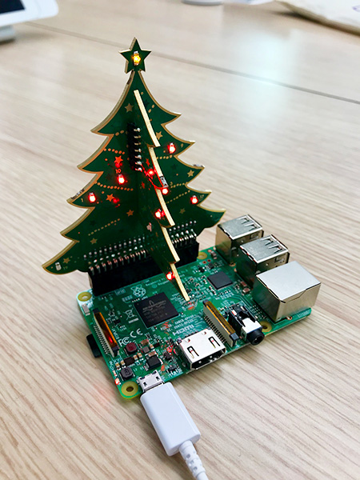

# The Pi Hut Xmas Tree Advent Calendar
A Python program to display an advent calendar using LEDs on The Pi Hut's 3D Xmas Tree for Raspberry Pi 🎄

The LED for the current day now flashes so it's easier to see! Thanks to **mfraser** for the suggestion 👍



## Installation
Run the following command on your Raspberry Pi:

```sudo apt-get install python-gpiozero python3-gpiozero```

Then copy the Python file (`xmas-tree-advent.py`) to your Raspberry Pi.

## Running the Program
Start the program by running `python xmas-tree-advent.py`.

You can also run the program in the background so you can disconnect from the Pi and keep it running:

```nohup python xmas-tree-advent.py &```
